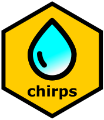

<!-- badges: start -->
[](https://github.com/ropensci/software-review/issues/357)
[](https://joss.theoj.org/papers/3367fdbff2db55a60c1ab7d611017940)
[](https://cran.r-project.org/package=chirps)
[](https://codecov.io/gh/ropensci/chirps)
[](https://www.repostatus.org/#active)
[](https://zenodo.org/badge/latestdoi/225693680)
[](https://github.com/ropensci/chirps/actions)
<!-- badges: end -->

# *chirps*: API Client for CHIRPS and CHIRTS 

## Overview

**chirps** provides the API Client for the Climate Hazards Center 'CHIRPS' and 'CHIRTS'. The 'CHIRPS' data is a quasi-global (50°S – 50°N) high-resolution (0.05 arc-degrees) rainfall data set, which incorporates satellite imagery 
  and in-situ station data to create gridded rainfall time series for trend analysis and seasonal drought monitoring. 'CHIRTS' is a quasi-global (60°S – 70°N), high-resolution data set of daily maximum and minimum temperatures. For more details on 'CHIRPS' and 'CHIRTS' data please visit its official home page <https://www.chc.ucsb.edu/data>.

## Quick start

### From CRAN

The stable version is available through CRAN.

```r
install.packages("chirps")
```

### From GitHub

A development version that may have new features or bug fixes is available through GitHub.

``` r
library("remotes")

install_github("ropensci/chirps", build_vignettes = TRUE)
```

## Example

Fetch CHIRPS data from three points across the *Tapajós* National Forest (Brazil) from Jan-2017 to Dec-2017. The default procedure will download the COG files from the CHIRPS server and handle it internally using the package `terra`. This is more interesting when dealing with hundreds of points and days.

```r
library("chirps")

lonlat <- data.frame(lon = c(-55.0281,-54.9857, -55.0714),
                     lat = c(-2.8094, -2.8756, -3.5279))

dates <- c("2017-01-01", "2017-12-31")

dat <- get_chirps(lonlat, dates)

```

For a faster download of few datapoints (~ 10), the argument `server = "ClimateSERV"` can be used  

```r
library("chirps")

lonlat <- data.frame(lon = c(-55.0281,-54.9857, -55.0714),
                     lat = c(-2.8094, -2.8756, -3.5279))

dates <- c("2017-01-01", "2017-12-31")

dat <- get_chirps(lonlat, dates, server = "ClimateSERV")

```

## Going further

The full functionality of **chirps** is illustrated in the package vignette. The vignette can be found on the [package website](https://docs.ropensci.org/chirps/) or from within `R` once the package has been installed, e.g. via: 

``` r
vignette("Overview", package = "chirps")
```

## Use of CHIRPS data

While *chirps* does not redistribute the data or provide it in any way, we encourage users to cite Funk et al. (2015) when using CHIRPS and Funk et al. (2019) when using CHIRTS

> Funk C., Peterson P., Landsfeld M., … Michaelsen J. (2015). The climate hazards infrared precipitation with stations—a new environmental record for monitoring extremes. *Scientific Data*, 2, 150066. <https://doi.org/10.1038/sdata.2015.66>

> Funk, C., Peterson, P., Peterson, S., … Mata, N. (2019). A high-resolution 1983–2016 TMAX climate data record based on infrared temperatures and stations by the climate hazard center. *Journal of Climate*, 32(17), 5639–5658. <https://doi.org/10.1175/JCLI-D-18-0698.1>

## Meta

  - Please [report any issues or bugs](https://github.com/ropensci/chirps/issues).

  - License: MIT.

  - Get citation information for *chirps* in R by typing `citation(package = "chirps")`.

  - You are welcome to contribute to the *chirps* project. Please read our [contribution guidelines](CONTRIBUTING.md).

  - Please note that the *chirps* project is released with a a [Contributor Code of Conduct](https://ropensci.org/code-of-conduct/). By contributing to this project, you agree to abide by its terms.
