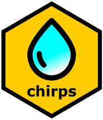

<!-- badges: start -->
[](https://github.com/ropensci/software-review/issues/357)
[](https://joss.theoj.org/papers/3367fdbff2db55a60c1ab7d611017940)
[](https://cran.r-project.org/package=chirps)
[](https://www.repostatus.org/#active)
[](https://zenodo.org/badge/latestdoi/225693680)
[](https://github.com/ropensci/chirps/actions/workflows/R-CMD-check.yaml)
[](https://app.codecov.io/gh/ropensci/chirps)
<!-- badges: end -->

# chirps: Access Climate Hazards Center Climate Datasets 

## Overview

**chirps** provides access to Climate Hazards Center (CHC) datasets including CHIRPS, CHIRPS v3, CHIRTS-daily, and CHIRTS-ERA5. Data can be retrieved either as extracted values for points and polygons or as native raster products for custom spatial workflows.

## Available Datasets

| Dataset | Variable | Resolution | Period |
|----------|----------|----------|----------|
| CHIRPS v2 | Precipitation | 0.05° / 0.25° | 1981–present |
| CHIRPS v3 | Precipitation | 0.05° | 1981–present |
| CHIRTS-daily | Tmax, Tmin, RHum, HeatIndex | 0.05° | 1983–2016 |
| CHIRTS-ERA5 | Tmax, Tmin | 0.05° | 1980–present |

## Applications

These datasets are commonly used for:

- Crop modeling
- Climate risk assessment
- Agricultural monitoring
- Seasonal analysis
- Environmental characterization
- Ecological and biodiversity studies

## Quick start

### From CRAN

The stable version is available through CRAN.

```r
install.packages("chirps")
```

### From GitHub

A development version that may have new features or bug fixes is available through GitHub.

``` r
library("remotes")

install_github("ropensci/chirps", build_vignettes = TRUE)
```

## Example

## Accessing raw raster products

The package can provide direct access to CHC climate datasets as `terra::SpatRaster` objects. This is useful when working with large spatial datasets or custom extraction workflows.

```r
library("chirps")
library("terra")

dates = c("2017-11-15", "2017-11-20")

# CHIRPS v2 precipitation
chirps_v2 = get_chirps_raw(dates = dates, version = "2.0")

# CHIRPS v3 precipitation
chirps_v3 = get_chirps_raw(dates = dates, version = "3.0", type = "sat")

# CHIRTS-ERA5 minimum temperature
tmin = get_chirts_era5_raw(dates = dates, var = "Tmin")

# CHIRTS-ERA5 maximum temperature
tmax = get_chirts_era5_raw(dates = dates, var = "Tmax")
```

Raster values can be extracted using functions from the `terra` package. Fetch CHIRPS data from three points across the Tapajós National Forest (Brazil) in January 2017.

```r
lonlat = data.frame(lon = c(-55.0281, -54.9857, -55.0714),
                    lat = c(-2.8094, -2.8756, -3.5279))

pts = vect(lonlat,
           geom = c("lon", "lat"),
           crs = "EPSG:4326")

rain = extract(chirps_v2, pts)
```

The resulting object contains daily values for each location and can be readily converted to a matrix or data frame for further analysis.

The recommended workflow is to retrieve native raster products using `get_chirps_raw()`, `get_chirts_raw()`, and `get_chirts_era5_raw()`, and then use the `terra` package for extraction and spatial analysis.

### Accessing high-level extraction

`get_chirps()` default procedure will download the COG files from the CHIRPS server and handle it internally using the package `terra`. This is more interesting when dealing with hundreds of points and days. Data can be returned as a matrix using the argument `as.matrix = TRUE`.

```r
library("chirps")

lonlat = data.frame(lon = c(-55.0281,-54.9857, -55.0714),
                    lat = c(-2.8094, -2.8756, -3.5279))

dates = c("2017-01-01", "2017-01-31")

dat = get_chirps(lonlat, dates, server = "CHC", as.matrix = FALSE)

```

For a faster download of few datapoints (~ 10 datapoints), the argument `server = "ClimateSERV"` can be used  

```r
library("chirps")

lonlat = data.frame(lon = c(-55.0281,-54.9857, -55.0714),
                    lat = c(-2.8094, -2.8756, -3.5279))

dates = c("2017-01-01", "2017-01-31")

dat = get_chirps(lonlat, dates, server = "ClimateSERV", as.matrix = FALSE)

```

## Going further

The full functionality of **chirps** is illustrated in the package vignette. The vignette can be found on the [package website](https://docs.ropensci.org/chirps/) or from within `R` once the package has been installed, e.g. via: 

``` r
vignette("Overview", package = "chirps")
```

## Citing Data

While *chirps* does not redistribute data, users should cite the original data providers when using CHIRPS, CHIRTS, CHIRTS-ERA5, or CHIRPS v3 products.

When using datasets obtained through this package, please cite the original data providers.

### CHIRPS v3
> Funk, C., Peterson, P., Harrison, L. et al. (2026). The Climate Hazards Center Infrared Precipitation with Stations, Version 3. Scientific Data, 13, 718. <https://doi.org/10.1038/s41597-026-07096-4>

### CHIRTS-ERA5
> CHIRTS-ERA5 Data Repository https://doi.org/10.15780/G2F08J (2025). Data was accessed on [DATE].

### CHIRPS v2
> Funk C., Peterson P., Landsfeld M., … Michaelsen J. (2015). The climate hazards infrared precipitation with stations—a new environmental record for monitoring extremes. *Scientific Data*, 2, 150066. <https://doi.org/10.1038/sdata.2015.66>

### CHIRTS
> Verdin, A., Funk, C., Peterson, P., Landsfeld, M., Tuholske, C., and Grace, K. (2020). Development and validation of the CHIRTS-daily quasi-global high-resolution daily temperature data set. Scientific Data, 7, 303.
<https://doi.org/doi{10.1038/s41597-020-00643-7>

## Meta

  - Please [report any issues or bugs](https://github.com/ropensci/chirps/issues).

  - License: MIT.

  - Get citation information for *chirps* in R by typing `citation(package = "chirps")`.

  - You are welcome to contribute to the *chirps* project. Please read our [contribution guidelines](CONTRIBUTING.md).

  - Please note that the *chirps* project is released with a a [Contributor Code of Conduct](https://ropensci.org/code-of-conduct/). By contributing to this project, you agree to abide by its terms.
