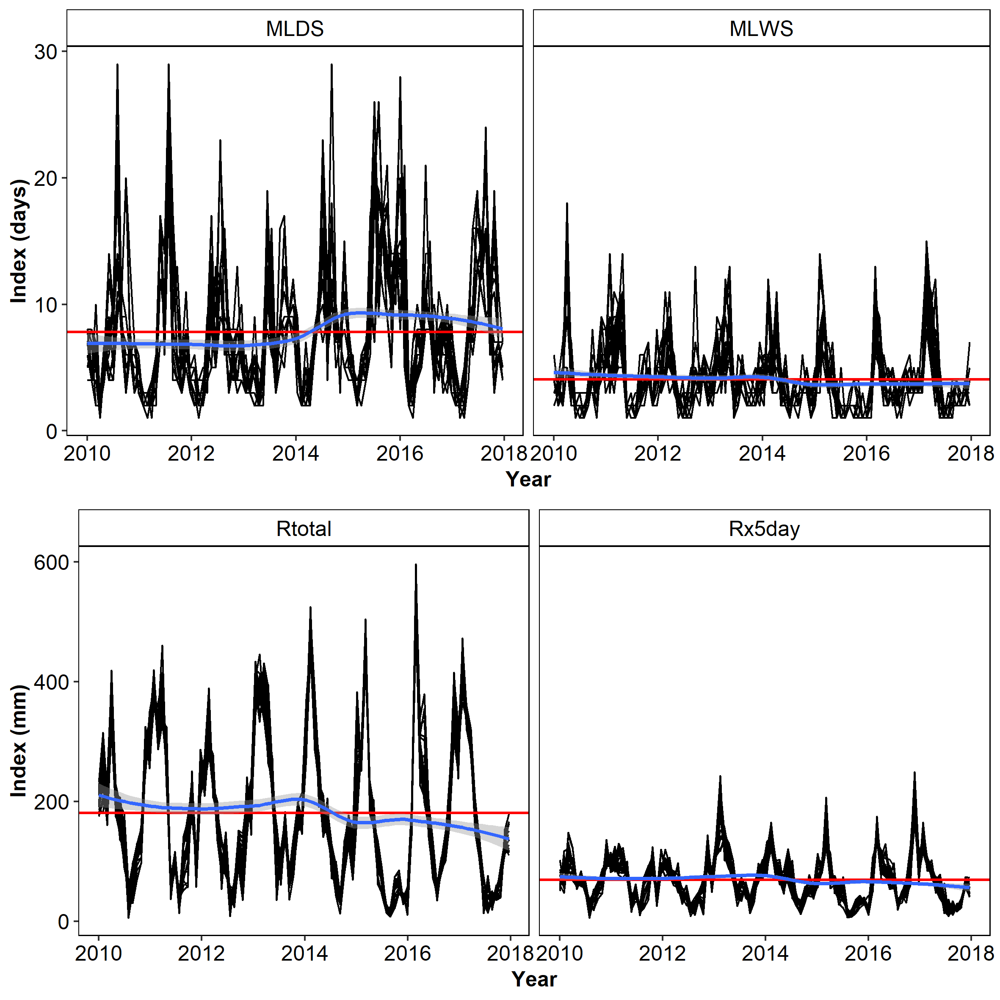

# Summary

The *chirps* package provides functionalities for reproducible analysis in R [@RCoreTeam] using the CHIRPS data [@Funk2015]. Three main functions are provided, `get_chirps()`, `get_esi()` and `precip_indices()`. The `get_chirps()` function provides access to CHIRPS data via the ClimateSERV API Client [@ClimateSERV] with methods to handle objects of class 'data.frame', 'geojson' and 'sf' via the package *methods* [@RCoreTeam]. To accept the query, ClimateSERV requires a geojson object of type 'Polygon' (one single polygon per request). Using the package *sf* [@sf] internally, the input provided in `get_chirps()` is transformed into a list of polygons with a small buffer area (0.0001 arc-sec by default) around the point and transformed into a list of geojson strings. If multiple points are required, `get_chirps()` does this process with a `lapply()` internal process. *chirps* uses *crul* [@crul] to interface with ClimateSERV API. The query returns a json object parsed to *jsonlite* [@jsonlite] to obtain the data frame for the time series required. `get_chirps()` returns a *tibble* data frame [@tibble], which also inherits the class 'chirps', where each id represents the index for the rows in the in-putted 'object'. The function `get_esi()` behaves similarly to `get_chirps()` and returns the evaporative stress index (ESI) data [@Anderson2011], but the output does not inherit the class 'chirps'. Users providing objects of class 'sf' and 'geojson' in `get_chirps()` and `get_esi()` can also opt to return an object with the same class as the object provided using the arguments 'as.sf = TRUE' or 'as.geojson = TRUE'. With the function `precip_indices()` users can assess how the precipitation changes across the requested time series using precipitation variability indices [@Aguilar2005], computed using *stats* [@RCoreTeam]. Extended documentation is provided with examples on how to increase the buffer area and draw quadrants for the geojson polygon using *sf* [@sf].

This process can be integrated into workflows like @vanEtten2019 to track how crop varieties responds to seasonal climate variability, and @DeSousa2018 to assess how extreme precipitation events are changing in a regional time series analysis. 

# About CHIRPS and ESI data

CHIRPS is daily precipitation data set developed by the Climate Hazards Group [@Funk2015] for high resolution precipitation gridded data. Spanning 50$^{\circ}$ S to 50$^{\circ}$ N (and all longitudes) and ranging from 1981 to near-present, CHIRPS incorporates 0.05 arc-degree resolution satellite imagery, and in-situ station data to create gridded precipitation time series for trend analysis and seasonal drought monitoring [@Funk2015]. The evaporative stress index (ESI) data describes temporal anomalies in evapotranspiration produced weekly at 0.25 arc-degree resolution for the entire globe [@Anderson2011]. The ESI data is based on satellite observations of land surface temperature, which are used to estimate water loss due to evapotranspiration (the sum of evaporation and plant transpiration from the Earth's land and ocean surface to the atmosphere). The ESI data is available from 2001 to near-present. When using these data sets in publications please cite @Funk2015 for CHIRPS and @esi for ESI.


# A case study in the Tapajós National Forest

The *Tapajós* National Forest is a protected area in the Brazilian Amazon. Located within the coordinates -55.4$^{\circ}$ and -54.8$^{\circ}$ E and -4.1$^{\circ}$ and -2.7$^{\circ}$ S with ~ 527,400 ha of multiple Amazonian ecosystems. We take twenty random points across its area to get the precipitation from Jan-2008 to Dec-2018 using `get_chirps()`. We use an object of class 'sf' which is passed to the method `get_chirps.sf()`. Then, we compute the precipitation indices for the time series with intervals of 30 days using `precip_indices()`.

```r
library("chirps")
library("sf")

tapajos <- chirps:::tapajos

dat <- get_chirps(tapajos, dates = c("2008-01-01","2018-01-31"))

pi <- precip_indices(dat, timeseries = TRUE, intervals = 30)

```

We selected four indices for the visualization using *tidyverse* [@tidyverse]. Plots were ensembled together using *gridExtra* [@gridExtra]. Here we see how these indices are changing across the time series (Figure 1). In this quick assessment, we note an increasing extent of consecutive dry days (MLDS) across the time series, with also a decrease in the number of consecutive rainy days (MLWS), which stays above the historical average for MLDS and bellow the historical average for MLWS. The trends also shows a decrease in the total rainfall in the 30-days intervals, staying bellow the average after 2014. Finally, we note a decrease in maximum consecutive 5-days precipitation, which also stays bellow the historical average. 

```{r, fig.cap="Trends in precipitation variability across the Tapajós National Forest, Brazil, for the period of 01-Jan-2010 to 31-Dec-2018 with four precipitation indices. MLDS, maximum length of consecutive dry days (days), MLWS, maximum length of consecutive wet days (days), Rtotal, total precipitation (mm), Rx5day, maximum consecutive 5-days precipitation (mm). Red lines indicates the historical mean of each index in the time series. Blue line indicates the smoothed trends in each index using the 'loess' method.", out.width = '90%', echo=FALSE}

```

Overall, these indices proved to be an excellent proxy to evaluate the climate variability using precipitation data [@DeSousa2018], the effects of climate change [@Aguilar2005], crop modelling [@Kehel2016] and to define strategies for climate adaptation [@vanEtten2019].


# Acknowledgements

This work was supported by the The Nordic Council of Ministers (https://www.norden.org/en). We thank Professor Roger Bivand for his insights during the development of this package.


# References