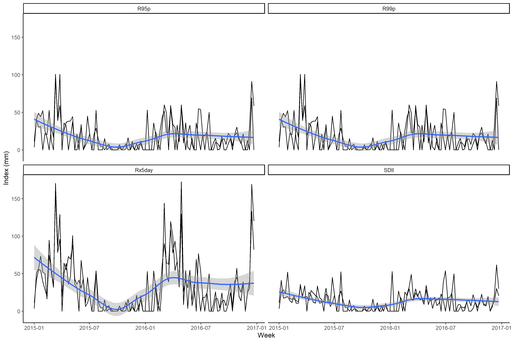
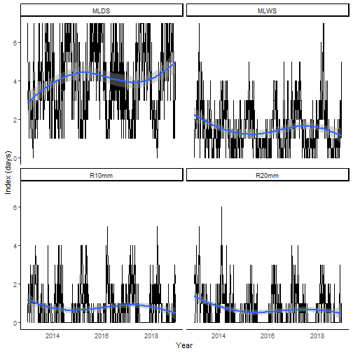

# Summary

The **chirps** package [@chirps] provides functionalities for reproducible analysis using the CHIRPS data [@Funk2015]. CHIRPS is a daily precipitation data set developed by the Climate Hazards Group [@Funk2015] for high resolution precipitation gridded data. Spanning 50°S - 50°N (and all longitudes) and ranging from 1981 to near-present (normally with a 45 day lag), CHIRPS incorporates 0.05 arc-degree resolution satellite imagery, and in-situ station data to create gridded precipitation time series for trend analysis and seasonal drought monitoring [@Funk2015]. Other functionalities of **chirps** are the computation of precipitation indices, the retrieval of the evaporative stress index (ESI) which describes temporal anomalies in evapotranspiration produced weekly at 0.25 arc-degree resolution for the entire globe, and the retrieval of IMERG data which provides near-real time global observations of rainfall at 0.5 arc-degree resolution.

# Usage

The *Tapajós* National Forest is a protected area in the Brazilian Amazon. Located within the coordinates -55.4° and -54.8°E and -4.1° and -2.7°S with ~527,400 ha of multiple Amazonian ecosystems. We take three random points across its area to get the precipitation from Jan-2013 to Dec-2018 using `get_chirps.sf()` for objects of class 'sf' [@sf].


```r
library("chirps")
library("sf")

data("tapajos", package = "chirps")

# sample three points within the Tapajos area
set.seed(1234)
tp_point <- st_sample(tapajos, 3)

# coerce as sf points
tp_point <- st_as_sf(tp_point)

dt <- get_chirps(tp_point, dates = c("2013-01-01","2018-12-31"))
```


The function `get_chirps()` returns a data.frame which inherits the classes 'chirps' and 'chirps_df', where each id represents the index for the rows in the in-putted 'object'. 


```r
dt
#>          id    lon   lat       date chirps
#>       <int>  <dbl> <dbl>     <date>  <dbl>
#> 1:        1 -55.03 -3.80 2013-01-01   0.00
#> 2:        1 -55.03 -3.80 2013-01-02  12.05
#> 3:        1 -55.03 -3.80 2013-01-03  24.11
#> 4:        1 -55.03 -3.80 2013-01-04   0.00
#> 5:        1 -55.03 -3.80 2013-01-05   0.00
#> ---                                       
#> 6569:     3 -55.03 -3.41 2018-12-27   0.00
#> 6570:     3 -55.03 -3.41 2018-12-28   0.00
#> 6571:     3 -55.03 -3.41 2018-12-29   0.00
#> 6572:     3 -55.03 -3.41 2018-12-30   0.00
#> 6573:     3 -55.03 -3.41 2018-12-31   0.00
```

With `precip_indices()` is possible to assess how the precipitation changes across a time series using precipitation variability indices [@Aguilar2005]. Here, we take the indices for intervals of 15 days and compute the indices for the time series (from Jan-2013 to Dec-2018).


```r
p_ind <- precip_indices(dt, timeseries = TRUE, intervals = 15)

p_ind
#>          id       date    lon   lat  index  value
#>       <int>     <date>  <dbl> <dbl>  <chr>  <dbl>
#> 1:        1 2013-01-01 -55.03 -3.80   MLDS   7.00
#> 2:        1 2013-01-01 -55.03 -3.80   MLWS   2.00
#> 3:        1 2013-01-01 -55.03 -3.80  R10mm   1.00
#> 4:        1 2013-01-01 -55.03 -3.80  R20mm   3.00
#> 5:        1 2013-01-01 -55.03 -3.80 Rx1day  47.37
#> ---                                              
#> 3446:     3 2018-12-16 -55.03 -3.41 Rx5day  53.90
#> 3447:     3 2018-12-16 -55.03 -3.41   R95p  34.53
#> 3448:     3 2018-12-16 -55.03 -3.41   R99p  34.53
#> 3449:     3 2018-12-16 -55.03 -3.41 Rtotal  80.49
#> 3450:     3 2018-12-16 -55.03 -3.41   SDII  13.42
```

The function `precip_indices()` returns a data.frame with the precipitation indices. Each date corresponds to the first day in the time series intervals as defined by the argument 'intervals'. When `timeseries = FALSE` the function returns a single precipitation index for the entire time series.

There are two main types of indices. Those that are expressed in days ("MLDS", "MLWS", "R10mm", "R20mm") and those that are expressed in mm ("R95p", "R99p", "Rx5day", "SDII"). We split these indices to visualise the time series.


```r
library("tidyverse")

mm <- c("R95p","R99p","Rx5day","Rtotal")
days <- c("MLDS","MLWS","R10mm","R20mm")

p_ind %>% 
  filter(index %in% mm) %>% 
  group_by(index) %>% 
  mutate(ab = mean(value)) %>% 
  ggplot() +
  geom_line(aes(x = date, y = value, group = id)) + 
  geom_hline(aes(yintercept = ab), colour = "red", lwd = 0.7) +
  geom_smooth(aes(x = date, y = value), method = "loess") +
  facet_wrap(. ~ index) +
  labs(x = "Year", y = "Index (mm)") +
  theme_classic()
```




Now plot the indices expressed in days.


```r
p_ind %>% 
  filter(index %in% days) %>% 
  group_by(index) %>% 
  mutate(ab = mean(value)) %>% 
  ggplot() +
  geom_line(aes(x = date, y = value, group = id)) + 
  geom_hline(aes(yintercept = ab), colour = "red", lwd = 0.7) + 
  geom_smooth(aes(x = date, y = value), method = "loess") +
  facet_wrap(. ~ index) +
  labs(x = "Year", y = "Index (days)") +
  theme_classic()
#> `geom_smooth()` using formula 'y ~ x'
```



Here we see how these indices are changing across the time series. In this quick assessment, it is possible to see that the maximum precipitation in consecutive 5-days (Rx5day) is higher in the first weeks of each year, which agree with the beginning of the rainy season in this region. However, the trend shows a decreasing in Rx5day across the years. In the other chart we note an increasing extent of consecutive dry days (MLDS) across the time series, with also a decrease in the number of consecutive rainy days (MLWS).  

# Going further

## Evapotranspiration 

The **chirps** package also retrieves the Evaporative Stress Index (ESI) using the function `get_esi()` which behaves similarly as `get_chirps()`. 


```r

dt <- get_esi(tp_point, c("2016-05-01","2016-12-31"))

```

The function `get_esi()` may return `NA`s due to cloudiness in the dataset. Which will return an error message:


```r
set.seed(123)
lonlat <- data.frame(lon = runif(1, -55, -54),
                     lat = runif(1, -3, -2.7))

get_esi(lonlat, c("2017-12-01","2018-01-20"))

```

One way to deal with this is increase the buffer area around the in-putted object with the argument `dist` passed to `st_buffer()` from *sf* through the `...` functionality in `get_esi()`. The argument `nQuadSegs` defines the number of segments per quadrant in the buffer.  


```r

get_esi(lonlat, c("2017-12-01","2018-01-20"), dist = 0.1, nQuadSegs = 6)

```

## Objects of class sf

To return an object with the same class (`sf`), the argument `as.sf = TRUE` is used.


```r

get_chirps(tapajos, dates = c("2017-12-15","2017-12-31"), as.sf = TRUE)

```
## Objects of class geojson

`get_chirps()` and `get_esi()` also contains a method for objects of class geojson with geometries 'Point' and 'Polygon'. To return an object with the same class (`geojson`), the argument `as.geojson = TRUE` is used.


```r

tp_gjson <- sf_to_geojson(tp_point)

dt <- get_esi(tp_gjson, dates = c("2017-12-15","2017-12-31"), dist = 0.1)

```

# Limitations

While **chirps** provides an API for reproducible analysis using CHIRPS data in R its functionalities has some limitations. The main limitation, is that the API provider [ClimateSERV](https://climateserv.servirglobal.net/) requires each location point to be requested individually. Let's say that you have 1000 points, to give you the data from your request **chirps** will send the call to the API provider 1000x, which may increase the time required to get the data in your R section. Before sending you request be aware that it can take several minutes for requests for a large timeseries (> 10 years) and large geographic coverage (global scale). 

# References


